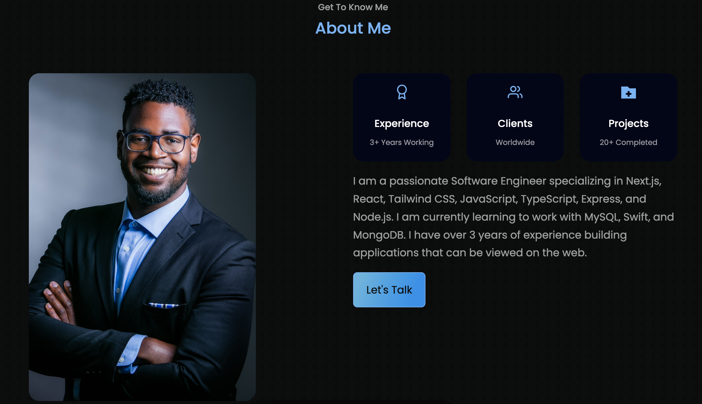

# Marquis Sampson Web Portfolio



**Marquis Sampson Web Portfolio** is a responsive personal portfolio website built with React, Vite, CSS, Framer Motion, AOS, Swiper, EmailJS, and React Icons.

## Project Overview

My presents my software engineering background, featured projects, technical skills, resume, and contact options in one interactive web experience. The application is structured as a single page portfolio where visitors can move between the header, about, skills, portfolio, contact, and footer sections. It was designed for recruiters, clients, collaborators, and other developers who want a clear view of my work and professional experience. The portfolio section showcases recent projects through a Swiper carousel with GitHub and live demo links. The contact section provides direct email, LinkedIn, GitHub, and an EmailJS message form.

## Features

- **Single page portfolio layout:** Visitors can browse all major sections without leaving the page.
- **Animated hero section:** Framer Motion, Typewriter Effect, and tsParticles create a dynamic landing experience.
- **Resume access:** The header includes a downloadable resume PDF for quick recruiter review.
- **Section navigation:** A floating icon navigation bar tracks the active page section while scrolling.
- **About section:** Experience, clients, completed projects, and a personal summary are presented in reusable cards.
- **Skills display:** Frontend, backend, tools, and interests are rendered from structured constants data.
- **Project carousel:** Swiper displays featured work with animated slides, GIF previews, GitHub links, live demos, and project tags.
- **Contact workflow:** EmailJS powers the contact form, while direct email, LinkedIn, and GitHub links support alternate outreach.
- **Scroll animations:** AOS adds entrance animations to major page sections.
- **Responsive design:** CSS media queries and responsive component sizing support phone, tablet, laptop, and desktop layouts.
- **Reusable component structure:** Header, navigation, about, skills, portfolio, contact, preloader, and footer are separated into focused React components.

## Overall Application Structure

The application follows a component-driven React architecture. `App` composes the full portfolio page by rendering the preloader, header, navigation, about section, skills section, portfolio carousel, contact form, and footer. Most user-facing content is stored directly in components or in `src/constants/index.js`, which provides the skills and portfolio project data used across the UI.

Data flows from the constants file into the skills and portfolio components, while user interaction flows through anchored links, scroll events, carousel controls, and the contact form. Visual behavior is split across component CSS files, styled-components in the skills section, Framer Motion animations, AOS scroll effects, and third-party UI libraries such as Swiper and tsParticles. EmailJS handles form submission through Vite environment variables, allowing the contact form to send messages without a custom backend.

## Component Architecture

### `App`

`App` is the root component for the portfolio and is responsible for composing the main page sections in order. It renders `PreLoader`, `Header`, `Nav`, `About`, `Skills0`, `Portfolio`, `Contact`, and `Footer`. This keeps the application flow simple and makes each portfolio section independently maintainable.

### `Header`

`Header` creates the first impression of the portfolio. It renders animated background technology logos, a tsParticles canvas, a Framer Motion greeting, a Typewriter Effect introduction, the resume/contact CTA buttons, and social links. The component also initializes the slim tsParticles engine and configures hover and click interactions for the particle background.

### `CTA`

`CTA` contains the two primary actions in the hero area: downloading the resume PDF and navigating to the contact section. It uses Framer Motion to animate both buttons into view, making the first user actions easy to notice.

### `HeaderSocials`

`HeaderSocials` displays social and external profile links near the hero content. It supports the broader header experience by separating social navigation from the main hero copy and call-to-action buttons.

### `Nav`

`Nav` renders the floating icon navigation used to move between portfolio sections. It listens to scroll position, compares it against each section's offset, and updates active link state so the current section is highlighted. The navigation includes anchors for home, about, skills, portfolio, and contact.

### `About`

`About` presents a personal summary with a headshot, experience cards, and a direct contact button. It initializes AOS for scroll animation and uses React Icons to visually distinguish experience, clients, and project-count highlights.

### `Skills0`

`Skills0` renders the skills section from the `skills` array in `src/constants/index.js`. It groups skills into categories such as Frontend, Backend, Tools, and Interests, then maps each skill into a styled item with an image and label. The component uses styled-components for its card layout and AOS for section animation.

### `Portfolio`

`Portfolio` displays featured projects from the `portfolio` array in `src/constants/index.js`. It uses Swiper with a coverflow effect, pagination, responsive slide sizing, project GIF previews, GitHub links, live demo links, and technology tags. The component also listens for viewport changes so the carousel layout adapts on smaller screens.

### `Contact`

`Contact` provides multiple ways to get in touch. It renders email, LinkedIn, and GitHub contact cards, then displays a form for name, email, and message fields. The form uses EmailJS with Vite environment variables for service ID, template ID, and user ID, allowing messages to be sent directly from the frontend.

### `Footer`

`Footer` closes the portfolio with repeated section links, social/contact icons, and a dynamic copyright year. It gives visitors one last place to navigate, reach out, or open my GitHub and LinkedIn profiles.

### `PreLoader`

`PreLoader` renders the initial loading experience before the main portfolio content appears. It helps the page feel more polished while visual assets and animated sections are preparing.

## Challenges Faced / What I Learned

Building this portfolio required balancing personality, animation, and usability. One challenge was creating a page that felt visually active without making the content difficult to scan. This was handled by separating the page into clear sections and using animation to support navigation rather than distract from it.

Another challenge was coordinating several frontend libraries in one React app. Framer Motion handles entrance animations, AOS handles scroll-triggered motion, Swiper manages the project carousel, tsParticles powers the hero background, and EmailJS handles message delivery. This project strengthened my understanding of how to organize third-party tools inside a component-based React application while keeping the page structure readable.

I also gained more experience building data-driven portfolio sections. By storing skills and projects in `src/constants/index.js`, the application can be updated with new technologies or featured work without rewriting the display components.

## Local Development

To run the project locally:

```bash
npm install
npm start
```

To create a production build:

```bash
npm run build
```

The contact form expects the following EmailJS environment variables:

```bash
VITE_EMAILJS_SERVICE_ID
VITE_APP_EMAILJS_TEMPLATE_ID
VITE_APP_EMAILJS_USER_ID
```

## Deployment

This project is deployed as a static React portfolio website.

The live application is available at: https://marquiswebportfolio.com/
